# Visual Defect Detection System

## Project Overview

This project implements a computer vision system for classifying manufacturing product images as Normal or Defective.

It demonstrates the complete workflow from dataset inspection and reproducible preparation through transfer learning, evaluation, CPU inference, FastAPI serving, and Docker configuration.

## Dataset Strategy

The assessment stated that a small Normal/Defective dataset would be provided, but that dataset was not available during implementation. The public MVTec AD `bottle` category was therefore used as a temporary substitute to demonstrate the complete pipeline. MVTec was not supplied as part of the assessment.

### Temporary Development Dataset: MVTec AD

MVTec AD is an industrial anomaly and defect detection dataset. This implementation repurposes the available bottle product images as a supervised binary classification task:

- `good` -> `Normal`
- `broken_large`, `broken_small`, and `contamination` -> `Defective`

The pixel-level masks under `ground_truth/` are not used as classification inputs. The data-loading and preparation workflow can be adapted to the intended assessment or client dataset when it becomes available.

The original `bottle` directory should be placed at `data/raw/bottle/` without reorganizing or relabeling its contents:

```text
data/raw/bottle/
|-- train/
|   `-- good/
|-- test/
|   |-- good/
|   |-- broken_large/
|   |-- broken_small/
|   `-- contamination/
`-- ground_truth/
```

Dataset inspection is read-only. Preparation copies product images into `data/processed/` with collision-safe filenames while leaving the raw MVTec structure unchanged.

### Dataset Preparation and Split

The original MVTec AD split is designed for anomaly detection, so its training set contains only defect-free images. For this supervised binary classification assessment, the usable product images are reorganized into reproducible stratified training, validation, and test splits.

| Split | Normal | Defective | Total |
|---|---:|---:|---:|
| Train | 160 | 44 | 204 |
| Validation | 34 | 9 | 43 |
| Test | 35 | 10 | 45 |
| **Total** | **229** | **63** | **292** |

The generated split is approximately 70/15/15 and uses random seed `42`. It can be regenerated from `data/raw/bottle/` with `python src/prepare_dataset.py`.

## Preprocessing and Augmentation

All inputs are converted to three-channel RGB, resized to 224x224 pixels, converted to tensors, and normalized with ImageNet mean and standard deviation. Training additionally uses `RandomHorizontalFlip` and `RandomRotation(10)`; validation, test, and inference preprocessing is deterministic.

DataLoaders use a default batch size of `16` and `num_workers=0` for Windows and CPU compatibility. The current development environment is CPU-only.

## Model Architecture and Selection

The classifier uses MobileNetV3 Small with ImageNet pretrained features and a final linear layer producing two raw logits. ImageFolder determines the class mapping as `defective = 0` and `normal = 1`; the mapping is stored in each checkpoint and read back during evaluation and inference. Softmax is applied only when probabilities are needed, not inside the model used with cross-entropy loss.

MobileNetV3 Small was selected because transfer learning is appropriate for this small dataset, the architecture is relatively lightweight, and it offers a practical model-size and latency tradeoff for CPU inference. It is a deployment-oriented choice for this assessment, not a claim that MobileNetV3 Small is universally the best architecture.

## Training Strategy

### Class Imbalance Handling

The training split is imbalanced, with 160 Normal and 44 Defective images. Inverse-frequency weights are calculated dynamically from those training targets and passed to `CrossEntropyLoss` in ImageFolder index order:

- Defective: `2.318182`
- Normal: `0.637500`

No oversampling is used.

### Baseline Failure and Error Analysis

The initial baseline froze the entire feature extractor and trained only the classifier with Adam at `0.001`. Its final test accuracy was `0.777778`, but Defective recall and F1 were both `0.000000`:

```text
                 Predicted
                 Defective   Normal
Actual Defective          0       10
Actual Normal             0       35
```

The baseline predicted every test image as Normal. Accuracy alone was therefore misleading under the class imbalance, motivating controlled fine-tuning and validation Defective F1 model selection. The baseline report is preserved at `outputs/baseline_evaluation_results.txt`.

### Controlled Fine-Tuning

The selected experiment keeps earlier feature extractor layers frozen and trains only MobileNetV3 `features[12]` plus the classifier. It retains weighted `CrossEntropyLoss` and uses two Adam parameter groups:

- Classifier learning rate: `0.0005`
- Final feature block learning rate: `0.0001`
- Maximum epochs: `20`
- Early stopping patience: `5`
- Random seed: `42`

Checkpoints are selected primarily by validation Defective F1, with lower validation loss as the tie-breaker. The selected checkpoint is epoch 18 at `models/best_model_finetuned.pth`.

## Evaluation Results

The selected checkpoint was evaluated once on the untouched 45-image test set after validation-based model selection.

| Metric | Defective | Normal | Macro |
|---|---:|---:|---:|
| Precision | 1.000000 | 0.972222 | 0.986111 |
| Recall | 0.900000 | 1.000000 | 0.950000 |
| F1 | 0.947368 | 0.985915 | 0.966642 |

- Test samples: `45`
- Accuracy: `0.977778`
- TP: `9`, FP: `0`, FN: `1`, TN: `35`
- Predicted Defective: `9`, Predicted Normal: `36`

```text
                 Predicted
                 Defective   Normal
Actual Defective          9        1
Actual Normal             0       35
```

### False Positive and False Negative Analysis

A false positive is a Normal product classified as Defective. A false negative is a Defective product classified as Normal. The final model produced zero false positives and one false negative:

```text
File: contamination_014.png
Actual: Defective
Predicted: Normal
Confidence: 0.544797
```

False negatives can be particularly important in manufacturing inspection because a defective product may pass inspection. This error had relatively low confidence compared with highly confident examples, suggesting that confidence-based human review could be explored as a future improvement; no human-review workflow is implemented here. Full results are stored in `outputs/final_evaluation_results.txt`.

## Known Limitations

The project has the following limitations:

- MVTec AD `bottle` is a substitute for the unavailable intended assessment or client dataset.
- The dataset is small and represents only one product category.
- The test set has only 45 images, including 10 Defective examples.
- Limited data creates a risk of overfitting.
- Results may not generalize to other products or real manufacturing environments.
- Docker configuration was statically reviewed, but Docker runtime was not verified locally.

Additional representative production data and validation would be required before deployment; these results alone do not establish production readiness.

## Local Setup

From the project root on Windows, create and activate a virtual environment:

```powershell
python -m venv venv
.\venv\Scripts\Activate.ps1
```

Install CPU-only PyTorch first from its official wheel index, then install the declared project requirements. The second command keeps the already satisfied CPU builds of torch and torchvision:

```powershell
python -m pip install --index-url https://download.pytorch.org/whl/cpu torch torchvision
python -m pip install -r requirements.txt
```

Place the original MVTec `bottle` directory at `data/raw/bottle/`, then inspect and prepare it:

```powershell
python src/inspect_dataset.py data/raw/bottle
python src/prepare_dataset.py
```

The selected checkpoint is included for inference. To reproduce model development or evaluation from the prepared data, use:

```powershell
python src/train.py
python src/evaluate.py
```

Training is CPU-only and may take several minutes. Evaluation reads the selected checkpoint and uses only `data/processed/test/`.

## API Usage

The FastAPI application performs CPU-only inference using `models/best_model_finetuned.pth`. Start it from the project root with:

```powershell
python -m uvicorn api.main:app --host 127.0.0.1 --port 8000
```

Available endpoints:

- `GET /` returns the API status message.
- `GET /health` reports whether the model is loaded.
- `POST /predict` accepts one JPEG, PNG, or BMP image as a multipart form field named `file`.

Example prediction response:

```json
{
  "predicted_class": "Defective",
  "confidence": 0.95
}
```

The `0.95` confidence above is illustrative. One verified API request used `broken_large_008.png` and returned `Defective` with confidence `0.9999998807907104`; that single example does not represent overall performance.

## Docker / Deployment

The Docker configuration packages the CPU-only inference API and the fine-tuned checkpoint for reproducible deployment. The dataset is not required in the container; prediction images are supplied through `POST /predict`.

Build the image:

```powershell
docker build -t visual-defect-detection .
```

Run the container:

```powershell
docker run --rm -p 8000:8000 visual-defect-detection
```

After startup:

- API: `http://localhost:8000`
- Health endpoint: `http://localhost:8000/health`
- Interactive FastAPI documentation: `http://localhost:8000/docs`

Local FastAPI verification completed successfully on the development machine. The Docker configuration was statically reviewed, but Docker runtime verification was not performed because Docker was unavailable in the current environment.

## Reproducibility

- Dataset splitting is deterministic with seed `42`, and `data/processed/` can be regenerated from `data/raw/bottle/`.
- Python and PyTorch random generators are seeded with `42` before training.
- Neural-network training is not claimed to be fully deterministic across every platform and library version.
- The selected checkpoint is included, and the training script can regenerate a checkpoint from prepared data.
- Each checkpoint stores `class_to_idx`, image size, model metadata, validation metrics, epoch, and training configuration.
- Evaluation and inference read the class mapping from the checkpoint rather than assuming class indices.

## System Architecture

The system separates offline dataset and model development from CPU-only runtime inference. The test split is used only for final evaluation, not for training or checkpoint selection.

```mermaid
flowchart LR
    subgraph DATA["Data development flow"]
        direction TB
        MVTec["MVTec AD<br/>Bottle category"]
        Raw["data/raw/bottle"]
        Inspect["src/inspect_dataset.py<br/>Read-only validation"]
        Prepare["src/prepare_dataset.py<br/>Binary mapping and seeded split"]
        Processed["data/processed"]
        TrainSplit["train<br/>normal / defective"]
        ValSplit["val<br/>normal / defective"]
        TestSplit["test<br/>normal / defective"]

        MVTec --> Raw
        Raw --> Inspect
        Inspect -. validated inputs .-> Prepare
        Raw --> Prepare
        Prepare --> Processed
        Processed --> TrainSplit
        Processed --> ValSplit
        Processed --> TestSplit
    end

    subgraph MODEL["Model development flow"]
        direction TB
        Dataset["src/dataset.py<br/>ImageFolder and DataLoaders"]
        Transforms["224x224 preprocessing<br/>ImageNet normalization<br/>Training augmentation only"]
        Training["src/train.py<br/>CPU training"]
        MobileNet["MobileNetV3 Small<br/>ImageNet weights"]
        Loss["Weighted CrossEntropyLoss<br/>Adam parameter groups"]
        FineTune["Controlled fine-tuning<br/>features[12] + classifier"]
        Selection["Validation Defective F1<br/>Loss tie-breaker"]
        Checkpoint["models/best_model_finetuned.pth"]
        Evaluation["src/evaluate.py<br/>Final test evaluation"]
        Results["outputs/final_evaluation_results.txt"]

        TrainSplit --> Dataset
        ValSplit --> Dataset
        Dataset --> Transforms --> Training
        Training --> MobileNet --> Loss --> FineTune --> Selection
        ValSplit --> Selection
        Selection --> Checkpoint
        Checkpoint --> Evaluation
        TestSplit --> Evaluation
        Evaluation --> Results
    end

    subgraph INFERENCE["Production inference flow"]
        direction TB
        Client["Client<br/>Uploaded image"]
        API["FastAPI<br/>POST /predict"]
        Validation["MIME type and<br/>empty-file validation"]
        Pillow["Pillow decoding<br/>Convert to RGB"]
        Predictor["src/inference.py<br/>DefectPredictor loaded once"]
        InferencePrep["Resize to checkpoint size<br/>ToTensor + ImageNet normalization"]
        CPUModel["MobileNetV3 Small<br/>CPU inference"]
        Softmax["Softmax probabilities"]
        Prediction["Predicted class<br/>+ confidence"]
        Response["JSON response"]

        Client --> API --> Validation --> Pillow --> Predictor
        Checkpoint --> Predictor
        Predictor --> InferencePrep --> CPUModel --> Softmax
        Softmax --> Prediction --> Response
    end

    subgraph DEPLOYMENT["Deployment packaging"]
        direction TB
        Dockerfile["Dockerfile<br/>python:3.13-slim"]
        Container["CPU-only FastAPI image<br/>api + src + fine-tuned checkpoint"]
        Uvicorn["Uvicorn<br/>api.main:app"]
        Port["Port 8000"]

        Dockerfile --> Container --> Uvicorn --> Port
        Checkpoint -. packaged .-> Container
    end
```



## Submission Checklist

- [x] Dataset analysis and reproducible preparation
- [x] Binary Normal/Defective classifier
- [x] Dynamic class-imbalance handling
- [x] ImageNet transfer learning with MobileNetV3 Small
- [x] CPU training and final test evaluation
- [x] Precision, recall, F1, and confusion matrix reporting
- [x] False-positive and false-negative error analysis
- [x] Selected fine-tuned checkpoint
- [x] FastAPI CPU inference API
- [x] Upload validation and API error handling
- [x] Illustrative and verified example predictions
- [x] System architecture diagram
- [x] Docker configuration and static review
- [x] Local setup, training, evaluation, and API instructions
- [x] Known limitations and dataset disclosure
- [ ] Docker runtime verification (Docker unavailable locally)
- [ ] Demo video (not created yet)
